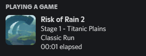
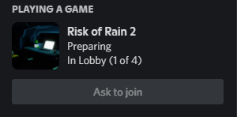

# Discord Rich Presence

| [Install using Thunderstore Mod Manager](ror2mm://v1/install/thunderstore.io/WhelanB/DiscordRichPresence/3.0.0/) | [Download from Thunderstore](https://thunderstore.io/package/WhelanB/DiscordRichPresence/) |
|----------------------------------------|----------------------------|
## About

Risk of Rain 2 does not currently expose game information to Discord, and so this mod was created in order to integrate Risk of Rain 2 with Discord's rich presence system. Show your Discord friends your current run state, invite channels to play, or ask to join a friend, all via Discord!

## Current Features
Join your friends through Discord, either by inviting them or having them ask to join your game!

Rich presence is provided for Classic Runs. The current stage count and stage name are exposed, and icons give an at-a-glance view of the current stage. Hovering over the icon reveals the stage subtitle. The current elapsed run time is shown on stages.

Example of Presence on Menu:

Example of Presence in run:

Example of Presence in Multiplayer Lobby:

Example of Channel Invite:

## Command
The mod provides a privacy setting via console commands, `discord_privacy_level`, which takes a single integer as an argument:

| State         | Value | Outcome                                                                            |
|---------------|-------|------------------------------------------------------------------------------------|
| Disabled      | 0     | no rich presence is broadcast                                                      |
| Run Presence  | 1     | run and lobby information is broadcast, but invites and join requests are disabled |
| Full Presence | 2     | run and lobby information is broadcast, invites and join requests are allowed      |

## Build
Requires R2API, BepInEx and [Discord-RPC-Csharp](https://github.com/Lachee/discord-rpc-csharp) (barebones Unity3D dlls, see readme)

## Installation

| [Install using Thunderstore Mod Manager](ror2mm://v1/install/thunderstore.io/WhelanB/DiscordRichPresence/3.0.0/) | [Download from Thunderstore](https://thunderstore.io/package/WhelanB/DiscordRichPresence/) |
|----------------------------------------|----------------------------|

## Versions

- Version 3.0.1 updates mod to support Survivors of the Void

- Version 3.0.0 updates mod to support the Risk of Rain 2 Anniversary Update

- Version 2.3.0 fixes elapsed time on pause, adds additional presence for menus

- Version 2.2.X introduces proper elapsed run time

- Version 2.1.1 fixes small issues - STABLE

- Version 2.1.X introduces elapsed run time

- Version 2.X.X introduces lobby features

- Versions 1.X.X include run cards only

## Known Issues

ConCommand currently disabled for Anniversary Update

## Credits

Some stage photos are provided by [The Risk of Rain 2 Fandom Wiki](https://riskofrain2.fandom.com/wiki/Risk_of_Rain_2_Wiki) under [CC BY-NC-SA 3.0](https://www.fandom.com/licensing).